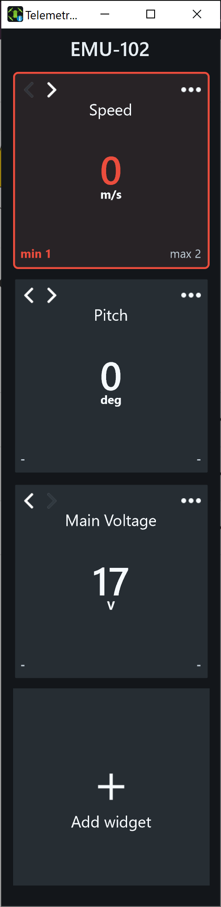
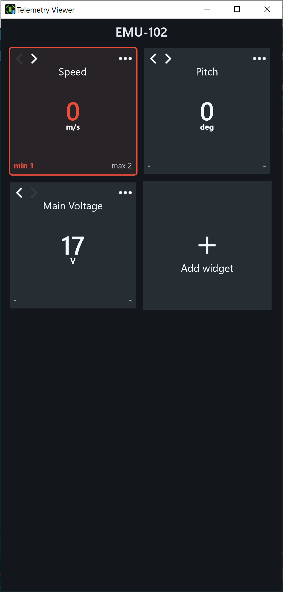
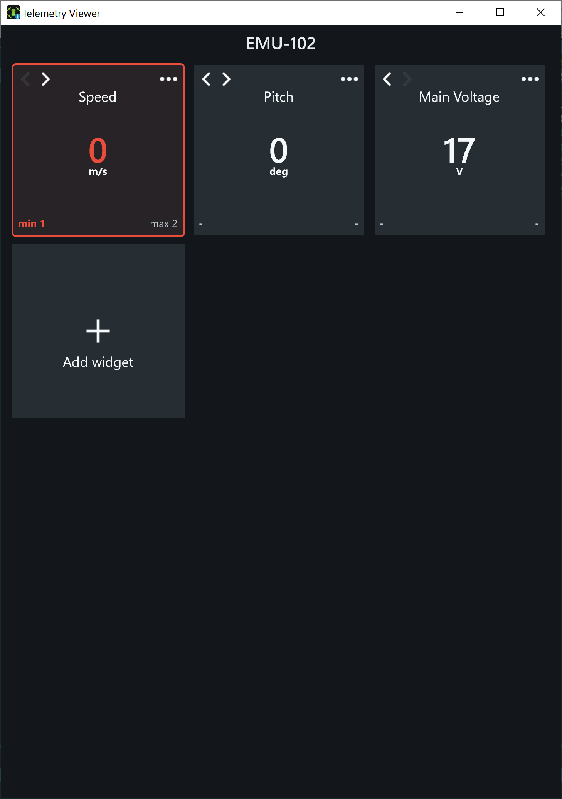

# UgCS Telemetry Viewer #

## What is Telemetry Viewer?

It is a desktop app that connects to a UgCS server and display user chosen telemetry for the vehicle that is currently selected in UgCS 3D Client.

### Concept ###

The main window of the app is a canvas for widgets. A widget responsible for displaying telemetry somehow. There can be many types of widgets to displaying the same telemetry in different ways (text, indicators, etc). By placing widgets on the canvas the user makes his own telemetry layout.

### Features ###

* Connecting to a UgCS Server:
  * Autodiscovering the UgCS server in the network;
  * Ability to provide the UgCS server address and port if the UgCS server isn't discovered automatically;
  * Blocking UI with a warning when the UgCS server goes offline;
  * Automatically connection restorsion with the UgCS server when the UgCS server goes online.

* Adding widgets on the canvas:
  * Quick search telemetry by a code from the fields, registered by the VSM;
  * Provide additionnal widget-specific data.

* Displaying telemetry for the vehicle selected in the UgCS Desktop Client;
* Widgets reordering by clicking on the arrow buttons.
* Storing layout configuration for each vehicle separately.

### Widgets ###
* Numeric telemetry basic widget:
  * Displaying a number rounded to a specified number of fractional digits with Caption, Units and Thresholds values (if provided by user);
  * Highlighting the value when out of range.

## Why this app was developed?

* For UgCS users who has to control some specific telemetry that is not displayed in UgCS 3D Clientd telemetry panel.
* For developers who use UgCS dotnet-sdk in their projects, as an example of UgCS dotnet-sdk usage.  

## Restrictions

Only numeric1 telemetry currently supported. 

## Layout examples
Resize the main window to change column count.

| One column | Two columns | Three columns |
|---|---|---|
|  |  |  |

### How do I build? ###

* Prerequisites: [.Net Core 3.1 SDK](https://dotnet.microsoft.com/download/dotnet-core/3.1).
* To build the solution execute `dotnet build /p:Configuration=Release;Version=<version>;FileVersion=<version>;AssemblyVersion=<version>` from `/src/` directory. Where `<version>` should be replaced with the actual build version.
* If you want .Net Core dependencies being included into the build, then use `dotnet publish TelemetryViewer.sln -r win-x64 --self-contained true  -p:Configuration=Release;Version="<version>";FileVersion="<version>";AssemblyVersion="<version>"` from `/src/` directory. Where `<version>` should be replaced with the actual build version.

---
1 - By numeric mean any telemetry field registered by the VSM with the one of following semantics: `S_NUMERIC`, `S_LATITUDE`, `S_LONGITUDE`, `S_ALTITUDE_AMSL`, `S_ALTITUDE_AGL`, `S_ALTITUDE_RAW`, `S_HEADING`, `S_VOLTAGE`, `S_AIR_SPEED`, `S_GROUND_SPEED`, `S_VERTICAL_SPEED`, `S_SATELLITE_COUNT`, `S_ROLL`, `S_PITCH`, `S_YAW`, `S_RC_LINK_QUALITY`, `S_CURRENT`, `S_GCS_LINK_QUALITY`, `S_FOV_H`, `S_FOV_V`, `S_GROUND_ELEVATION`, `S_ACCEPTANCE_RADIUS`, `S_LOITER_RADIUS`, `S_MILLISECONDS`, `S_CAPACITY_LEVEL`, `S_TEMPERATURE`, `S_HUMIDITY`, `S_PRECIPITATION`, `S_TIMESTAMP`.